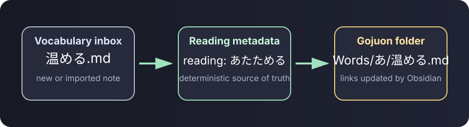

# Kotoba Vault

Local-first tools for organizing Japanese language-learning notes in Obsidian.

[](https://github.com/saegusa1996/kotoba-vault/actions/workflows/ci.yml)
[](https://github.com/saegusa1996/kotoba-vault/actions/workflows/codeql.yml)
[](LICENSE)

Kotoba Vault turns a `reading` property into predictable gojūon
folders, keeps Obsidian links intact while notes move, and offers a dry-run-first
migration CLI for existing Markdown vocabulary collections.



> Current release: [v0.1.0](https://github.com/saegusa1996/kotoba-vault/releases/tag/v0.1.0).

## Why this exists

Large language-learning vaults can become slow to browse when many notes share
one folder, and kanji filenames cannot be filed by pronunciation without
explicit reading metadata. This project treats the reading as the source of
truth:

```yaml
---
reading: あたためる
aliases:
  - 温め
---
```

The note is placed in `Japanese/Words/あ/` because its normalized reading starts
with `あ`. Dakuten, handakuten, small kana, and katakana are normalized to the
matching base gojūon folder.

Every public example and regression fixture is synthetic. The repository does
not contain or require a learner's notes, books, subtitles, audio, or video.

## Included tools

### Obsidian plugin

- Watches only the configured vocabulary root and inbox.
- Moves a note after its `reading` property changes.
- Uses Obsidian's file manager so internal links are updated normally.
- Debounces metadata events and scans only the inbox at startup.
- Offers a non-mutating inbox preview with movable, unresolved, and collision
  counts.
- Provides commands to sort the current note or the whole inbox.
- Has no telemetry, network calls, or external runtime dependencies.

### Migration CLI

- Reads existing `reading`, kana filenames, bracket readings, or kana aliases.
- Adds missing `reading` properties without rewriting note bodies.
- Plans gojūon moves and reports unresolved notes and collisions.
- Detects duplicate planned destinations before the first write.
- Writes metadata atomically and can fail closed on any unresolved note.
- Does nothing unless `--apply` is supplied.
- Uses only the Python standard library.

## Install the plugin manually

1. Download `main.js` and `manifest.json` from the latest release.
2. Create `.obsidian/plugins/kotoba-vault/` in your vault and copy both files
   into it.
3. Reload Obsidian and enable **Kotoba Vault**.
4. Set your vocabulary root, inbox, and reading-property name in settings.

The default layout is:

```text
Japanese/
├── Inbox/
└── Words/
    ├── あ/
    ├── い/
    └── ...
```

## Migrate an existing collection

Always preview first:

```bash
python tools/migrate_word_notes.py --root "/path/to/vault/Japanese/Words"
```

Save the plan for review:

```bash
python tools/migrate_word_notes.py \
  --root "/path/to/vault/Japanese/Words" \
  --json migration-plan.json
```

Apply only after resolving reported collisions:

```bash
python tools/migrate_word_notes.py \
  --root "/path/to/vault/Japanese/Words" \
  --apply
```

Back up the vault before any bulk migration.

For an all-or-nothing review gate, add `--fail-on-unresolved`. See
[Migration safety](docs/migration-safety.md) for the complete preflight
workflow.

To reproduce a non-personal scale test, use the
[synthetic vault generator](docs/synthetic-benchmark.md).

## Test

```bash
pnpm test
python -m unittest discover -s tests -p "test_*.py"
```

For a contributor build, run `pnpm install --frozen-lockfile` followed by
`pnpm build`.

## Project principles

- Local-first and offline by default.
- Deterministic transformations with a dry run.
- Synthetic test fixtures only.
- No redistribution of source books, media, or third-party subtitles.
- Human review before bulk changes.

See [Getting started](docs/getting-started.md),
[Architecture](docs/architecture.md),
[Compatibility](docs/compatibility.md),
[Synthetic scale testing](docs/synthetic-benchmark.md),
[Privacy and copyright](docs/privacy-and-copyright.md), and the
[Roadmap](ROADMAP.md).

## Contributing

Issues and pull requests are welcome. Read [CONTRIBUTING.md](CONTRIBUTING.md)
and [CODE_OF_CONDUCT.md](CODE_OF_CONDUCT.md) first.

## License

[MIT](LICENSE)
